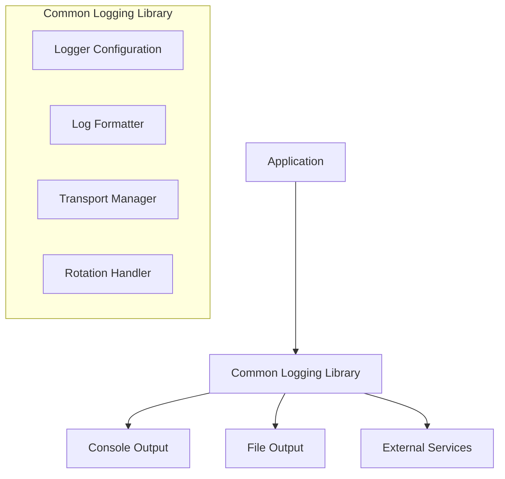

# System Patterns

## System Architecture
The project is designed as a Node.js library that can be installed and reused across multiple applications. The library follows a modular architecture that allows for easy integration into existing Node.js backends.

## Key Technical Decisions

1. **Based on Latest Node.js**
   - Utilizing features available in the latest Node.js version
   - Ensuring compatibility with contemporary Node.js applications
   - Taking advantage of performance improvements in newer Node.js releases

2. **Package Structure**
   - Designed as an npm package for easy installation via package managers
   - Clear exports for simplified integration
   - Minimal dependencies to avoid bloat

3. **Modular Design**
   - Core logging functionality separated from transport mechanisms
   - Pluggable architecture for different output destinations
   - Configurable components that can be tailored to specific needs

4. **Interface Patterns**
   - Fluent API design for intuitive usage
   - Consistent method signatures across logging levels
   - Context propagation between logging calls

5. **Configuration Strategy**
   - Sensible defaults to minimize required configuration
   - Environment-based configuration options
   - Runtime reconfiguration capabilities
   - Configuration validation